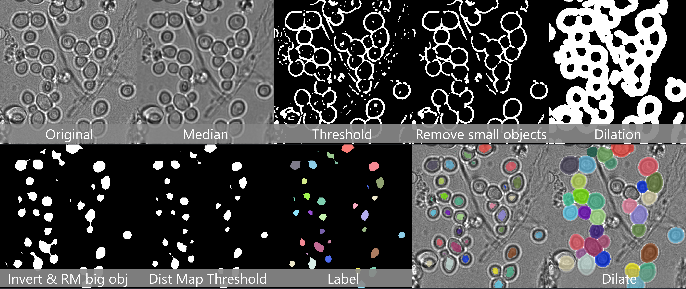

# Classical cell segmentation

An example of a workflow using classical operations to segment blobby cells.

- [Notebook](CellSegmentationClassic.ipynb)
- [UV environment specs](cell_segmentation_classic/pyproject.toml)

